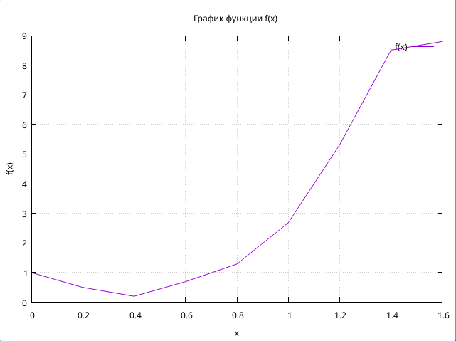
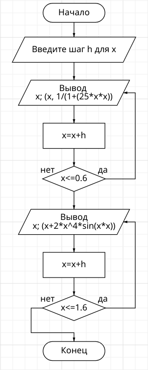
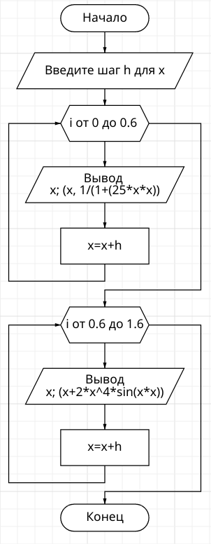

# Лабораторная работа №2
### Задание
1. Напишите программу по варианту, используя оператор цикла while (нечётные варианты) или do while (чётные варианты).
2. Напишите программу, используя оператор цикла for.
3. Постройте график с использованием gnuplot.
4. Составьте блок-схемы.
5. Оформите отчёт в README.md. Отчёт должен содержать:
    1. Задание
    2. Описание проделанной работы
    3. Скриншоты результатов
    4. Блок-схемы
    5. График функции
    6. Ссылки на используемые материалы

### описание проделанной работы 
1. Написал программу по варианту 8 используя цикл do while \
#### Инструкция по запуску
1. Открыть папку XRevLab2 с помощью VSCodium
2. Вызвать консоль и прописать `gcc cntrlv.c -lm -o result` 
3. прописать в консоли `./result` 
###
2. Написал программу по варианту 8 используя цикл for
#### Инструкция по запуску
1. Открыть папку XRevLab2 с помощью VSCodium
2. Вызвать консоль и прописать `gcc cntrlv_for.c -lm -o result` 
3. прописать в консоли `./result` 
###
3. Построил график с использование gnuplot\

###
4. Составил блок схемы\
While \

\
for \

5. Оформил отчёт
# Ссылки
1. https://evil-teacher.on.fleek.co/prog_pm/term1/lab02/
2. https://programforyou.ru/block-diagram-redactor
